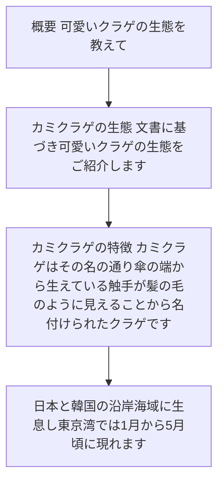
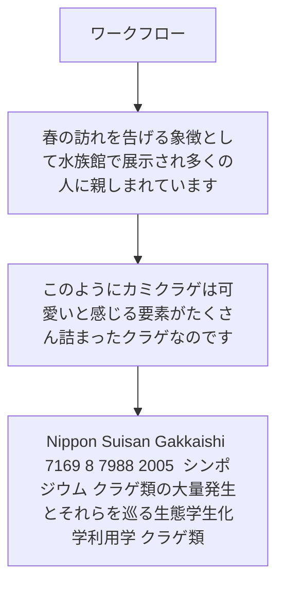

# 可愛いクラゲの生態を教えて

# カミクラゲの生態

文書に基づき、可愛いクラゲの生態をご紹介します。

## カミクラゲの特徴

カミクラゲは、その名の通り傘の端から生えている触手が髪の毛のように見えることから名付けられたクラゲです。日本と韓国の沿岸海域に生息し、東京湾では1月から5月頃に現れます。

## なぜ可愛いと感じるのか

1. **独特の外見**：髪の毛のような触手が特徴…

---

## 概要: 可愛いクラゲの生態を教えて

- # カミクラゲの生態 文書に基づき、可愛いクラゲの生態をご紹介します
- ## カミクラゲの特徴 カミクラゲは、その名の通り傘の端から生えている触手が髪の毛のように見えることから名付けられたクラゲです
- 日本と韓国の沿岸海域に生息し、東京湾では1月から5月頃に現れます
- ## なぜ可愛いと感じるのか 1

Sources: kurage_symposium.pdf (#1)

---

## 主要ポイント

- **独特の外見**：髪の毛のような触手が特徴的で、見た目が優しげです 2
- **安全性**：本種による刺傷被害の報告はなく、比較的安心して観察できる 3
- **春を告げるクラゲ**：春先に各地の海で採集され、水族館で「春を告げるクラゲ」として展示されることもあります 4
- **キュウリのようなにおい**：独特のキュウリに似たにおいを持ち、そのにおい物質は（E）-2-nonenalと（E,Z）-2,6-nonadienalです ## 生態 - 目で天…

| 項目 | 内容 |
| --- | --- |
| 要点 1 | **独特の外見**：髪の毛のような触手が特徴的で、見た目が優しげです 2 |
| 要点 2 | **安全性**：本種による刺傷被害の報告はなく、比較的安心して観察できる 3 |
| 要点 3 | **春を告げるクラゲ**：春先に各地の海で採集され、水族館で「春を告げるクラゲ」として展示されることもあります 4 |
| 要点 4 | **キュウリのようなにおい**：独特のキュウリに似たにおいを持ち、そのにおい物質は（E）-2-nonenalと（E,Z）-2,6-nonadienalです ## 生態 - 目で天… |

Sources: kurage_symposium.pdf (#1)

---

## ワークフロー

- 春の訪れを告げる象徴として水族館で展示され、多くの人々に親しまれています
- このように、カミクラゲは「可愛い」と感じる要素がたくさん詰まったクラゲなのです
- Nippon Suisan Gakkaishi 71(6),9 8 7988 (2005 ) シンポジウム クラゲ類の大量発生とそれらを巡る生態学生化学利用学 ．クラゲ類…
- 体成分とその利用学 内田直行 ， 半田慎也 ， 広海十郎 日本大学生物資源科学部海洋生物資源科学科 III

Sources: kurage_symposium.pdf (#1)

---

## 比較・整理

- Biochemistry and food science for utilization of jellyˆshes III1
- Chemical components of jellyˆshes and their utililization NAOYUKI UCHIDA, S INYA HANDA AN…
- Nippon Suisan Gakkaishi 71(6),9 6 9970 (2005 ) シンポジウム クラゲ類の大量発生とそれらを巡る生態学生化学利用学 ．クラゲ類…
- わが国で大量発生するクラゲの種類 上野俊 士 郎 水産大学校 I

Sources: kurage_symposium.pdf (#1)

