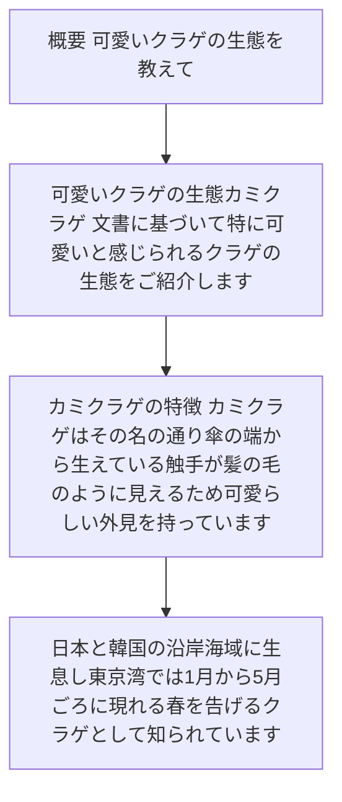
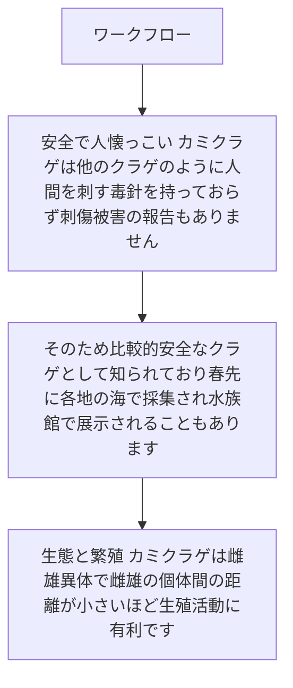

# 可愛いクラゲの生態を教えて

# 可愛いクラゲの生態：カミクラゲ

文書に基づいて、特に「可愛い」と感じられるクラゲの生態をご紹介します。

## カミクラゲの特徴

カミクラゲは、その名の通り傘の端から生えている触手が髪の毛のように見えるため、可愛らしい外見を持っています。日本と韓国の沿岸海域に生息し、東京湾では1月から5月ごろに現れる「春を告げるクラゲ」として知られています。

#…

---

## 概要: 可愛いクラゲの生態を教えて

- # 可愛いクラゲの生態：カミクラゲ 文書に基づいて、特に「可愛い」と感じられるクラゲの生態をご紹介します
- ## カミクラゲの特徴 カミクラゲは、その名の通り傘の端から生えている触手が髪の毛のように見えるため、可愛らしい外見を持っています
- 日本と韓国の沿岸海域に生息し、東京湾では1月から5月ごろに現れる「春を告げるクラゲ」として知られています
- ## 人間にとっての魅力 カミクラゲの最大の魅力は、独特の「キュウリに似たにおい」です

Sources: kurage_symposium.pdf (#1)

---

## 主要ポイント

- 新鮮なカミクラゲをすりつぶすと、キュウリのような香りが強くなります
- このにおいの正体は、（E）-2-nonenal（0
- 22 ppm）および（E,Z）-2,6-nonadienal（0
- 03 ppm）という2つの化合物で、これらはキュウリのにおい物質そのものです

| 項目 | 内容 |
| --- | --- |
| 要点 1 | 新鮮なカミクラゲをすりつぶすと、キュウリのような香りが強くなります |
| 要点 2 | このにおいの正体は、（E）-2-nonenal（0 |
| 要点 3 | 22 ppm）および（E,Z）-2,6-nonadienal（0 |
| 要点 4 | 03 ppm）という2つの化合物で、これらはキュウリのにおい物質そのものです |

Sources: kurage_symposium.pdf (#1)

---

## ワークフロー

- ## 安全で人懐っこい カミクラゲは、他のクラゲのように人間を刺す毒針を持っておらず、刺傷被害の報告もありません
- そのため、比較的「安全なクラゲ」として知られており、春先に各地の海で採集され、水族館で展示されることもあります
- ## 生態と繁殖 カミクラゲは雌雄異体で、雌雄の個体間の距離が小さいほど生殖活動に有利です
- 目で天敵を察知して逃げたり、日暮れ後に産卵したりする生態を持ち、春に活発に活動します

Sources: kurage_symposium.pdf (#1)

---

## 比較・整理

- ## まとめ カミクラゲは、髪の毛のような触手、キュウリのような香り、そして安全な性質から、クラゲの中でも特に「可愛い」と感じられる種です
- 春の訪れを告げる存在として、水族館でも人気があり、その独特の香りと優しい印象が、多くの人々に愛される理由となっています
- Nippon Suisan Gakkaishi 71(6),9 8 7988 (2005 ) シンポジウム クラゲ類の大量発生とそれらを巡る生態学生化学利用学 ．クラゲ類…
- 体成分とその利用学 内田直行 ， 半田慎也 ， 広海十郎 日本大学生物資源科学部海洋生物資源科学科 III

| 項目 | 内容 |
| --- | --- |
| 要点 1 | ## まとめ カミクラゲは、髪の毛のような触手、キュウリのような香り、そして安全な性質から、クラゲの中でも特に「可愛い」と感じられる種です |
| 要点 2 | 春の訪れを告げる存在として、水族館でも人気があり、その独特の香りと優しい印象が、多くの人々に愛される理由となっています |
| 要点 3 | Nippon Suisan Gakkaishi 71(6),9 8 7988 (2005 ) シンポジウム クラゲ類の大量発生とそれらを巡る生態学生化学利用学 ．クラゲ類… |
| 要点 4 | 体成分とその利用学 内田直行 ， 半田慎也 ， 広海十郎 日本大学生物資源科学部海洋生物資源科学科 III |

Sources: kurage_symposium.pdf (#1)

