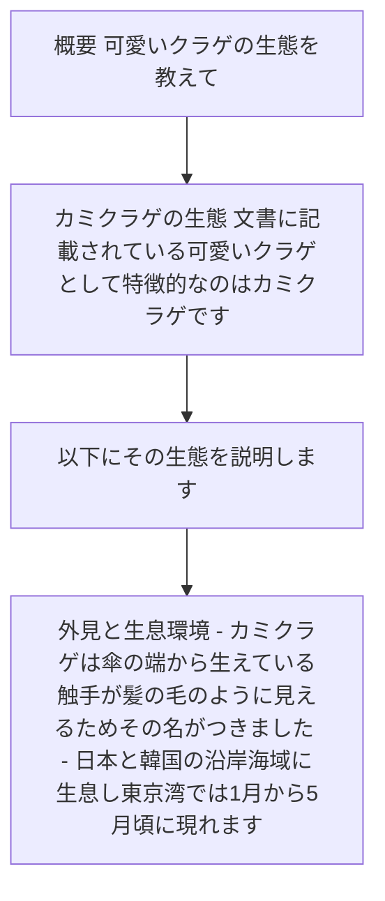
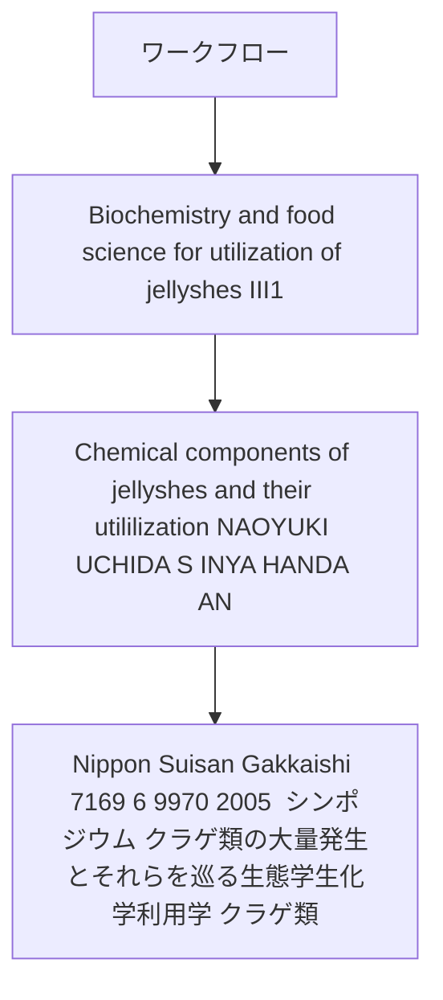

# 可愛いクラゲの生態を教えて

# カミクラゲの生態

文書に記載されている「可愛いクラゲ」として特徴的なのは「カミクラゲ」です。以下にその生態を説明します。

## 外見と生息環境
- カミクラゲは傘の端から生えている触手が髪の毛のように見えるため、その名がつきました
- 日本と韓国の沿岸海域に生息し、東京湾では1月から5月頃に現れます
- 春先に各地の海で採集され、「春を告げるクラゲ…

---

## 概要: 可愛いクラゲの生態を教えて

- # カミクラゲの生態 文書に記載されている「可愛いクラゲ」として特徴的なのは「カミクラゲ」です
- 以下にその生態を説明します
- ## 外見と生息環境 - カミクラゲは傘の端から生えている触手が髪の毛のように見えるため、その名がつきました - 日本と韓国の沿岸海域に生息し、東京湾では1月から5月頃に現れます…
- 22 ppm）と（E,Z）-2,6-nonadienal（0

Sources: kurage_symposium.pdf (#1)

---

## 主要ポイント

- 03 ppm）です - これはキュウリのにおい物質そのものと同じ成分で、アカクラゲやミズクラゲにはごく微量しか含まれていません ## 安全性 - カミクラゲは刺傷被害の報告がなく…
- 春を告げるクラゲとして、多くの人々に親しまれています
- Nippon Suisan Gakkaishi 71(6),9 8 7988 (2005 ) シンポジウム クラゲ類の大量発生とそれらを巡る生態学生化学利用学 ．クラゲ類…
- 体成分とその利用学 内田直行 ， 半田慎也 ， 広海十郎 日本大学生物資源科学部海洋生物資源科学科 III

| 項目 | 内容 |
| --- | --- |
| 要点 1 | 03 ppm）です - これはキュウリのにおい物質そのものと同じ成分で、アカクラゲやミズクラゲにはごく微量しか含まれていません ## 安全性 - カミクラゲは刺傷被害の報告がなく… |
| 要点 2 | 春を告げるクラゲとして、多くの人々に親しまれています |
| 要点 3 | Nippon Suisan Gakkaishi 71(6),9 8 7988 (2005 ) シンポジウム クラゲ類の大量発生とそれらを巡る生態学生化学利用学 ．クラゲ類… |
| 要点 4 | 体成分とその利用学 内田直行 ， 半田慎也 ， 広海十郎 日本大学生物資源科学部海洋生物資源科学科 III |

Sources: kurage_symposium.pdf (#1)

---

## ワークフロー

- Biochemistry and food science for utilization of jellyˆshes III1
- Chemical components of jellyˆshes and their utililization NAOYUKI UCHIDA, S INYA HANDA AN…
- Nippon Suisan Gakkaishi 71(6),9 6 9970 (2005 ) シンポジウム クラゲ類の大量発生とそれらを巡る生態学生化学利用学 ．クラゲ類…
- わが国で大量発生するクラゲの種類 上野俊 士 郎 水産大学校 I

Sources: kurage_symposium.pdf (#1)

---

## 比較・整理

- Jellyˆsh blooms and their eŠect I1
- Jellyˆsh species making bloom in Japanese waters SHUNSHIRO UENO National Fisheries Univer…
- クラゲ類 クラゲは刺胞動物の体制の一つで，基本的に傘構造を した浮遊生活者である
- 傘の内部は間充ゲル（中膠）が 発達し，体内外に硬い支持組織をもたないため体全体が柔軟である

Sources: kurage_symposium.pdf (#1)

